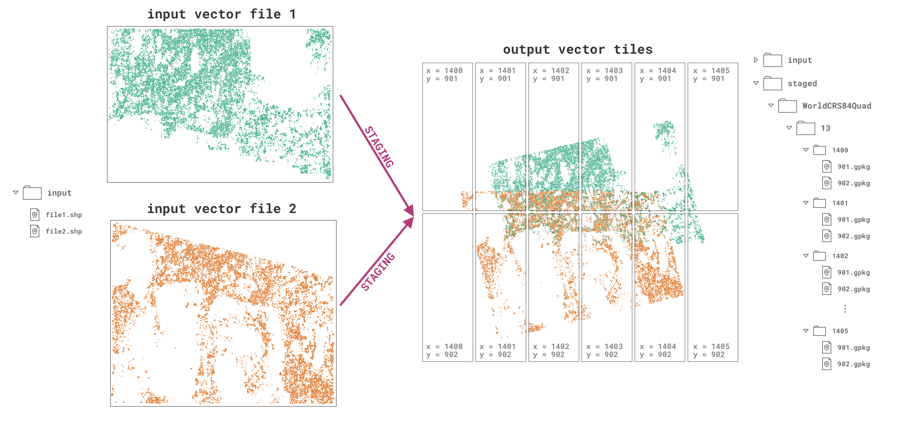

# Viz-staging: vector staging for the Permafrost Discovery Gateway visualization pipeline

- **Authors**: Robyn Thiessen-Bock ; Juliet Cohen ; Matthew B. Jones ; Kastan Day ; Lauren Walker
- **DOI**: [10.18739/A2RV0D26C](https://ezid.cdlib.org/id/doi:10.18739/A2RV0D26C)
- **License**: [Apache 2](https://opensource.org/license/apache-2-0/)
- [Package source code on GitHub](https://github.com/PermafrostDiscoveryGateway/viz-staging)
- [Submit bugs and feature requests](https://github.com/PermafrostDiscoveryGateway/viz-staging/issues/new)

The `pdgstaging` package divides vector files into tiled vector files according to a specified [OGC Two Dimensional Tile Matrix Set](http://docs.opengeospatial.org/is/17-083r2/17-083r2.html) in preparation for processing into other formats in the Permafrost Discovery Gateway (PDG) workflow.



## Citation

Cite this software as:

> Robyn Thiessen-Bock, Juliet Cohen, Matt Jones, Kastan Day, Lauren Walker. 2023. Viz-staging: vector staging for the Permafrost Discovery Gateway visualization pipeline (version 0.9.1). Arctic Data Center. doi: 10.18739/A2RV0D26C

## Install

Requires Python version `3.9` or `3.10` and `libspatialindex` or `libspatialindex-dev`

1. Follow the instructions to install [`libspatialindex`](https://libspatialindex.org/en/latest/) or [`libspatialindex-dev`](https://packages.ubuntu.com/bionic/libspatialindex-dev)
2. Make sure that Python version 3.9 or 3.10 is installed (try `which python3.9`).
3. Install `pdgstaging` from GitHub repo using pip: `pip install git+https://github.com/PermafrostDiscoveryGateway/viz-staging.git`

## Usage

4. Create a config JSON file for the staging job, see [the docs](docs/config.md) for details, `help(pdgstaging.ConfigManager)` for all configuration options, and `pdgstaging.ConfigManager.defaults` for default config values.

**From the command line:**
- run: `python -m pdgstaging -c '/path/to/config.json'`

**In python:**

```python
import pdgstaging
stager = pdgstaging.TileStager('/path/to/config.json')
stager.stage_all()

# OR, to stage only one file
stager.stage('path/to/input/file.shp')
```

See more example code in [`PermafrostDiscoveryGateway/viz-info/helpful-code`](https://github.com/PermafrostDiscoveryGateway/viz-info/tree/main/helpful-code)

## Vector file staging for the PDG tiling pipeline

This repository contains code that prepares vector data (e.g. shapefiles, geopackages) for subsequent steps in the [PDG](https://permafrost.arcticdata.io/) tiling pipeline (such as [viz-3dtiles](https://github.com/PermafrostDiscoveryGateway/viz-3dtiles) and [viz-raster](https://github.com/PermafrostDiscoveryGateway/viz-raster)). The staging step creates output vector files that conform to a specified [OGC Two Dimensional Tile Matrix Set](http://docs.opengeospatial.org/is/17-083r2/17-083r2.html) ("TMS"). Specifically, for each input file, the staging process:

1. Simplifies polygons and re-projects them to the Coordinate Reference System ("CRS") used by the desired TMS.
2. Assigns area, centroid, and other properties to each polygon.
3. Identifies duplicate polygons in the tiles. 
4. Saves polygons to one file for each tile in the specified level of the TMS.

Polygons are assigned to a tile file if the polygon is within the tile or if it intersects with the bounding box of the tile (i.e. if it is at least *partially* within that tile). This means that polygons that fall within two or more tiles will be duplicated in the output. (This allows subsequent rasterization steps to measure the area of polygons that are only partially within the tile - otherwise some area is lost). The duplicated polygons are labeled as such so they can be removed during staging or a later step in the PDG visualization pipeline. The step at which these polygons are removed is determined by the configuration file.  

However, polygon-tile relationships are also identified using the centroid of each polygon: The `centroid_tile` property assigned to polygons identifies the tile within which the polygon's centroid falls. (In the rare event that a polygon's centroid falls exactly on a tile boundary, the polygon will be added to the southern/eastern tile.)

The `centroid_within_tile` property is `True` when the polygon's centroid is within the same tile as the output file. To avoid using duplicated polygons in subsequent tiling steps (e.g. when generating 3D tiles), first filter out all polygons where `centroid_within_tile` is `False`.

The area and centroid of each polygon are calculated in the CRS of the TMS. When this is a geographic coordinate rather than a projected coordinate, the resulting values may vary slightly from the real values. 

## Polygon properties

After being run through this staging process, each polygon will be assigned the new properties that are listed below. The names of these properties are configurable, but the default names are used here.
- **staging_tile** (string) - The tile that this polygon has been assigned to (matches the file). Indicated as a string in the format `Tile(x=6, y=10, z=4)`.
- **staging_centroid_tile** (string) - The tile within which the centroid of this polygon falls (may differ from file). Indicated as a string in the format `Tile(x=6, y=10, z=4)`.
- **staging_area** (number) - The area of the tile in the units of the CRS
- **staging_centroid_x**, **staging_centroid_y** (number) - The x and y coordinate for the centroid of the tile (in the units of the CRS)
- **staging_filename** (string) - The path to the file from which this polygon originated
- **staging_identifier** (string) - A unique identifier for the polygon
- **staging_centroid_within_tile** (boolean) - True when the `centroid_tile` property matches the `tile`, i.e. when the centroid of the polygon is within the same tile as the file it is saved in
- **staging_duplicated** (boolean) - True when the polygon has been identified as a duplicate based on the deduplication method specified in the configuration

## Summary fields

The staging process will also output a summary CSV file with one row for each tile created from each file. The fields in the CSV are:
- **filename**: The path to the input vector file that was processed
- **num_polygons**: The number of polygons from that file that are in given tile
- **area_polygons**: The total area of the polygons from the file that are in the given tile
- **datetime**: The time at which polygons from this file were saved to the output tile
- **tile_x, tile_y, tile_z**: The x, y, and z indices for the tile
- **tile_top, tile_right, tile_bottom, tile_left**: The coordinates (bounding box) for the tile
- **tms_identifier**: The TMS that this tile belongs to

## Assumptions

- It is assumed that incoming vector data comprises only valid polygons. **Any non-polygon data is removed**, including multi-polygons, points, lines, or other geometries.
- It's also assumed that each incoming vector file is staged only once. If a file passes through the staging step twice, then all polygons from that file will be duplicated in the output (but with a different identifier). This is due to the fact that when a tile file already exists, additional polygons that belong to this tile will be appended to the file.
- The input data does not contain `NaN` values or infinite values, or if the data does contain one of these, then the value is known. Failing to specify this value in the configuration cause issues later in the visualization pipeline.
- For release 0.9.0, the deduplication method `neighbors` has not been thoroughly tested. The deduplication method should be `None` or `footprints`.
- If the deduplication method specified in the configuration is `footprints`, the footprint file(s) are provided with a structure that follows the [docs](https://github.com/PermafrostDiscoveryGateway/viz-staging/blob/main/docs/footprints.md).
- In order for logging to work properly, the node running the script that uses this package has a `/tmp` directory so the `log.log` file can populate there.

## Development

Build and test using poetry and pytest.

- To build, run `poetry build`
- To test, run `pytest` from the root of the package directory
- VS Code configuration is setup to configure tests as well

## License

```
Copyright [2013] [Regents of the University of California]

Licensed under the Apache License, Version 2.0 (the "License");
you may not use this file except in compliance with the License.
You may obtain a copy of the License at

http://www.apache.org/licenses/LICENSE-2.0

Unless required by applicable law or agreed to in writing, software
distributed under the License is distributed on an "AS IS" BASIS,
WITHOUT WARRANTIES OR CONDITIONS OF ANY KIND, either express or implied.
See the License for the specific language governing permissions and
limitations under the License.
```


