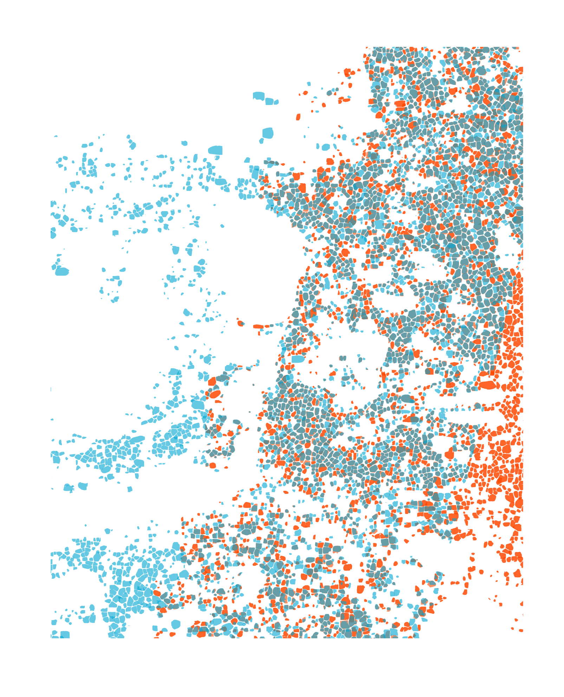
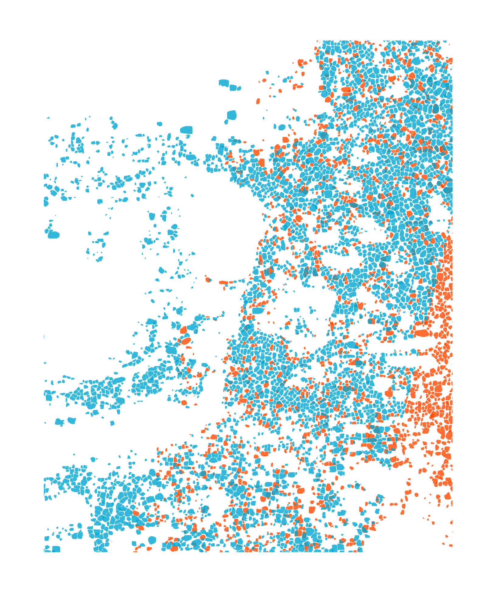
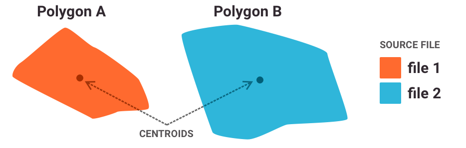
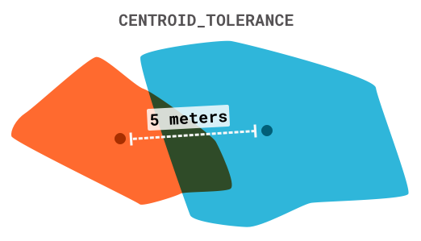
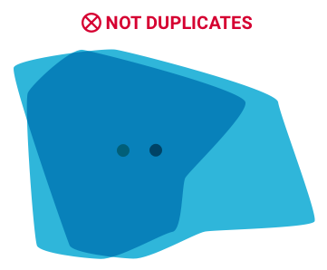
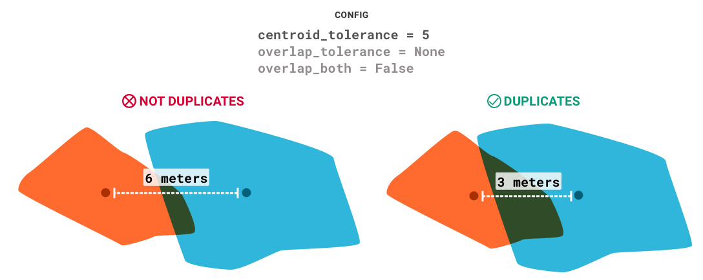
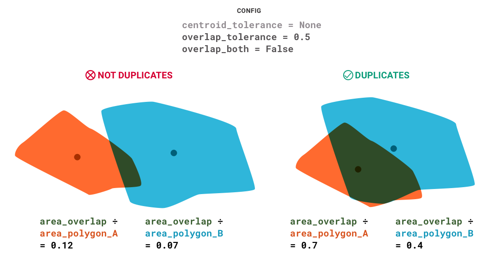
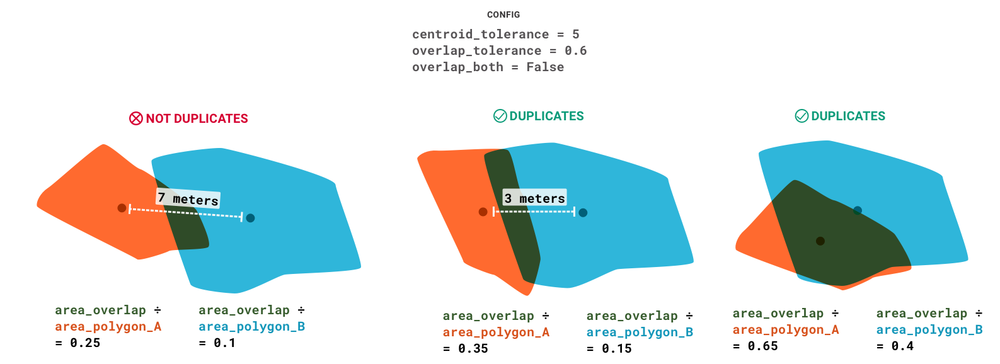
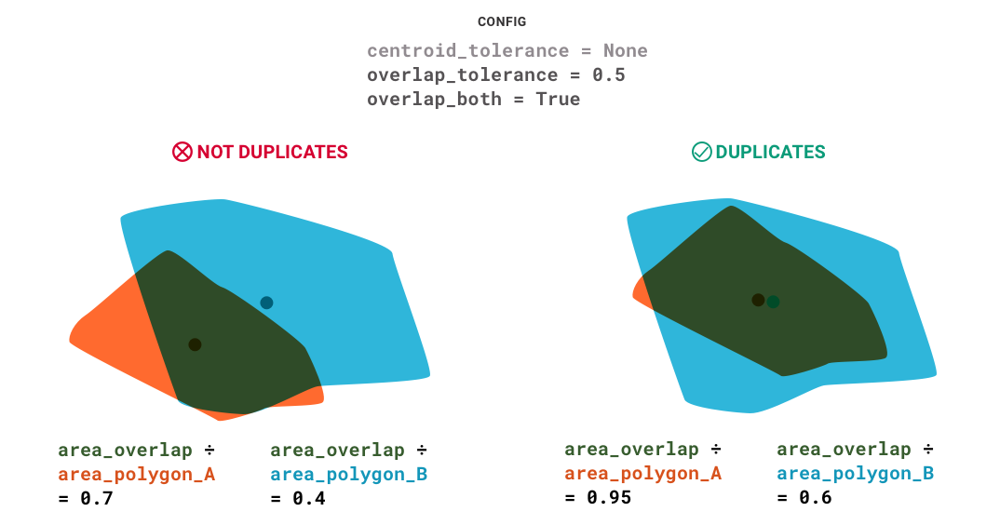

# Deduplication

## Before



## After



Uses the options:
```python
overlap_tolerance=0.5
overlap_both=True
centroid_tolerance=5
```

# How it works



## Configuration options




## Examples












## Testing

```python
import geopandas as gpd
import pandas as pd
from pdgstaging.Deduplicator import deduplicate, plot_duplicates

# Import two files that overlap
file1 = 'path/to/first/vector/file.shp'
file2 = 'path/to/second/vector/file.shp'

gdf1 = gpd.read_file(file1)
gdf2 = gpd.read_file(file2)

# Add properties (if they don't already exist)
gdf1['source_file'] = file1
gdf2['source_file'] = file2

gdf1['Date'] = '2019-01-01'
gdf2['Date'] = '2020-01-01'

gdf1['Area'] = gdf1.area
gdf2['Area'] = gdf2.area

gdf1['Centroid_x'] = gdf1.centroid.x
gdf1['Centroid_y'] = gdf1.centroid.y
gdf2['Centroid_x'] = gdf2.centroid.x
gdf2['Centroid_y'] = gdf2.centroid.y

# Combine the two files
gdf = pd.concat([gdf1, gdf2])

# Deduplicate
output = deduplicate(
    gdf,
    prop_overlap='source_file',
    prop_area='Area',
    prop_centroid_x='Centroid_x',
    prop_centroid_y='Centroid_y',
    keep_rules=[['Date', 'larger']],
    overlap_tolerance=0.5,
    overlap_both=True,
    centroid_tolerance=5,
    distance_crs='EPSG:3413',
    return_intersections=True
)

# See the output
plot_duplicates(output, 'source_file')

# Save the deduplicated file
output['keep'].to_file('path/to/output/file.shp')

```