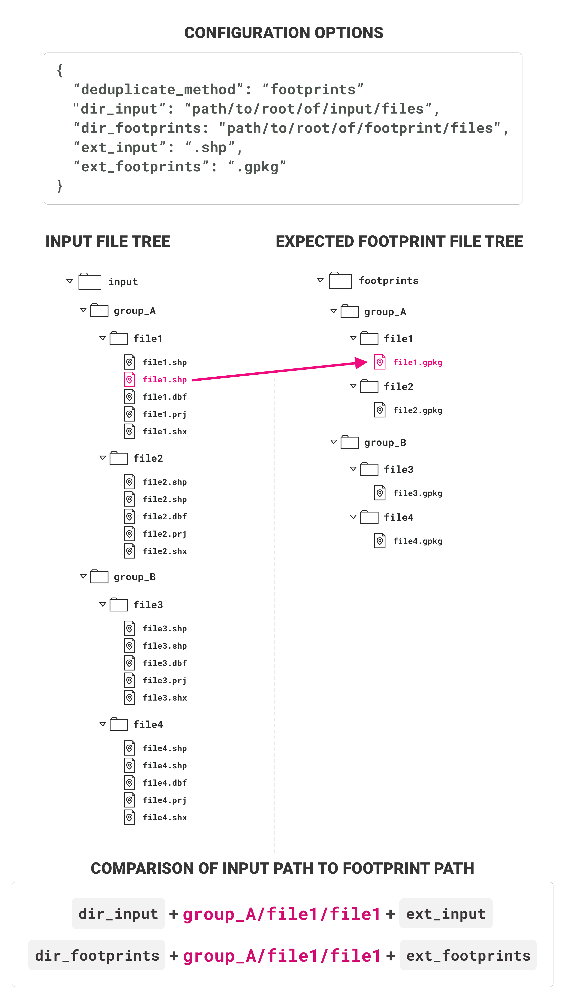
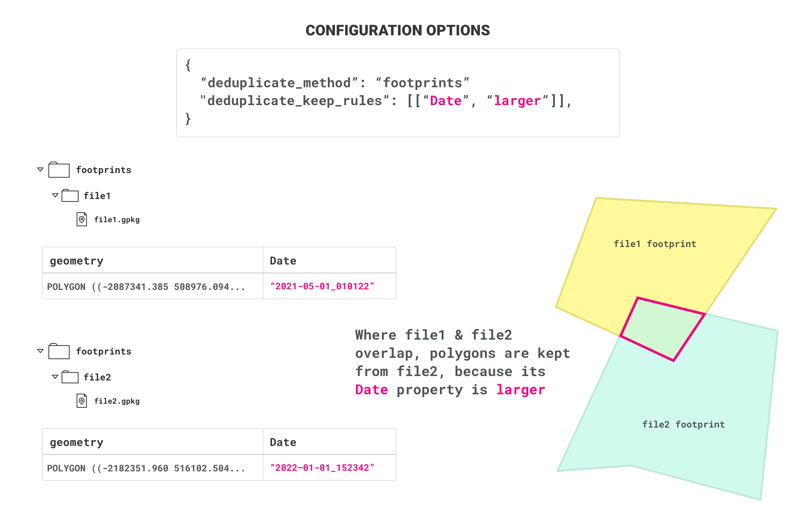

# Footprints for deduplication

To use the [footprint deduplication method](deduplication.md), every input file that
is listed in the input directory (configured as `dir_input`), must have it's boundary defined in an associated vector file, called the "footprint file." Here are the requirements for the footprints:

1. Each footprint file should contain one or more polygons that define the exact boundary/border of the associated input file
2. There must be one footprint file for each input file (in other words: each footprint file contains the boundary for only one input file)
3. The filename of the footprint file must exactly match the filename of the input file (the extension may differ)
4. The footprint files must be stored in the directory that is configured as `dir_footprints`
5. The footprints must have the extension that is configured as `ext_footprints`
6. If the input file is nested within `dir_input`, then the footprint file must be nested in identically named `subdirectories` in the `dir_footprint`. For example, if the path to the input file is `dir_input/group_A/file1/file1.ext`, then the path to the footprint file must be `dir_footprint/group_A/file1/file1.ext`
7. The footprint polygons must also have one or more properties that can be used to rank the files
in order of preference, such that only polygons from the preferred file are
kept in areas of overlap. These properties must match the properties configured in [`keep_rules`](deduplication.md)

**Important:** *The TileStager will, by default, check for the existence of a footprint file for each input vector file. However, if some or all footprints are missing, the stager will log a warning and proceed anyways. To check which footprints are missing first, run `TileStager(config).check_footprints()` before running `stage` or `stage_all`*

## Example

### File tree structure

When the input data follows a complex, nested file tree structure, the footprint file paths must follow the same structure

### Contents of footprint files

Each footprint file should contain the boundaries for just one input file. The boundary polygon(s) must have one or more properties that can be used to rank the input files by preference

