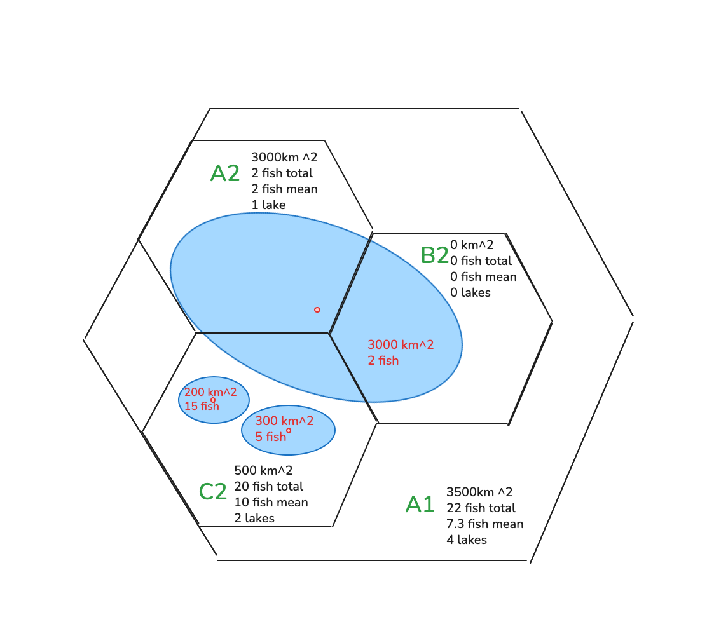

# H3 Grid Summary Generator

**Goal:** Convert feature geometries into H3 cell indices based on their center points, then aggregate total counts, raw areas, and custom feature attributes into a uniform hexagonal grid.

1. For any input geometry file: compute an absolute `_count` per H3 cell (how many feature centroids fall within the cell).
2. For polygon features: compute the total `area_km2` assigned to the cell (100% of a feature's area is credited to the single cell containing its centroid, conserving total dataset area).
3. Aggregate custom attributes using true mathematical sums (`sum_*`) and means (`mean_*`).
4. Optionally compute land-only statistics: `land_area_km2`, `land_fraction`, and `land_coverage_fraction` during final assembly.

### Summary Statistics Methodology

The `H3GridSummaryGenerator` calculates summary statistics by examining each feature in a dataset, and assigning that feature to one and only one H3 cell in each resolution requested. For points, the point itself is used, otherwise the centroid of the feature is used to determine which cell should contain the summary metrics. This method ensures aggregated metrics are conserved across zoom levels, and means can be calculated correctly.

The drawback to this method is that if there polygons that overlap multiple cells, summary metrics may be slightly overrepresented in some cells and underrepresented in neighboring cells, since each polygons is assigned 1 and only 1 cell. The diagram above illustrates how metrics are distributed to H3 cells from overlapping and non-overlapping polygons at two H3 zoom levels. The approach used benefits from its simplicity and computational efficiency. While we could distribute portions of overlapping polygons to multiple cells and get accurate area values for each cell, handling other variables, such as the mean temperature, or number of fish, would be more complex and likely require different algorithms depending on the variable and whether it is aggregated or averaged, increasing the risk of generating misleading or incorrect summary data. 

### Inputs

*   `input_path`: Path to an input vector dataset (.shp, .gpkg, .parquet).
*   `output_paths`: Dictionary mapping H3 resolutions to their final output GeoPackage paths (e.g., `{3: "out_res3.gpkg", 4: "out_res4.gpkg"}`).
*   `h3_res`: List of H3 resolutions to process simultaneously (e.g., `[3, 4]`).
*   `attr_to_sum` (optional): List of numeric column names to sum across features.
*   `attr_to_mean` (optional): List of numeric column names to average across features.
*   `land_polygons_path` (optional): Land/coastline polygon dataset path (applied in the combination step).
*   `area_epsg`: Equal-area EPSG code for accurate area computations (default `6933`).

### Outputs
*   **Intermediate:** Lightweight Parquet files (chunks) saved in an adjacent `/chunks/` directory.
*   **Final:** H3 polygon layers (GeoPackages) with fully aggregated attributes, created after combining all chunks.

---

## Methodology

### Chunking and Staging: `build_h3_summary()`
This method processes individual files and stages them as lightweight Parquet chunks.

1. **Load and Normalize CRS**
    * Read input into a GeoDataFrame.
    * Reproject to WGS84 (EPSG:4326) because H3 indexing expects lon/lat.
    * Filter out duplicate polygons that spilled over from adjacent processing tiles (eg: files generated by staging)
      using `staging_centroid_within_tile`.

2. **Vectorized Area Calculation**
    * If the dataset contains polygons, reproject to the `area_epsg`.
    * Store the total area by feature in a new `area_km2` column.

3. **Centroid-Based H3 Mapping**
    * Iterate through features. For every geometry, find its `centroid` and map it to exactly **one** H3 cell per resolution.

4. **Extract Metrics & Save to Parquet**
    * Create a record containing the `h3_index`, `_count: 1`, the full `area_km2`, and the raw values for any `attr_to_sum` or `attr_to_mean` columns. Note `attr_to_mean` columns are summed here, and actual means are calculated in the final aggregation.
    * Aggregate these records at the file level (summing everything, *including* the mean attributes to prepare for later division).
    * Save directly to `.parquet` (dropping geometries to maximize I/O speed).

### Final Aggregation: `combine_h3_summaries()`
This method gathers all generated Parquet chunks and merges them into the final spatial H3 grid.

1. **Merge & Sum**
    * Load all `.parquet` chunks for a given resolution and concatenate them.
    * Group by `h3_index` and perform a final summation of `_count`, `area_km2`, `sum_*` columns, and the staged `mean_*` columns.

2. **Calculate True Means**
    * To avoid statistical bugs, calculate means only at the very end (no mean-of-means with different sample sizes): 
    * `final_gdf["mean_col"] = final_gdf["mean_col"] / final_gdf["_count"]`

3. **Generate Geometries & Output**
    * Convert the string H3 indices back into hexagonal Shapely polygons.
    * (Optional) Intersect with `land_polygons_path` to generate `land_area_km2` metrics.
    * Export the final GeoDataFrame to the specified output GeoPackage.