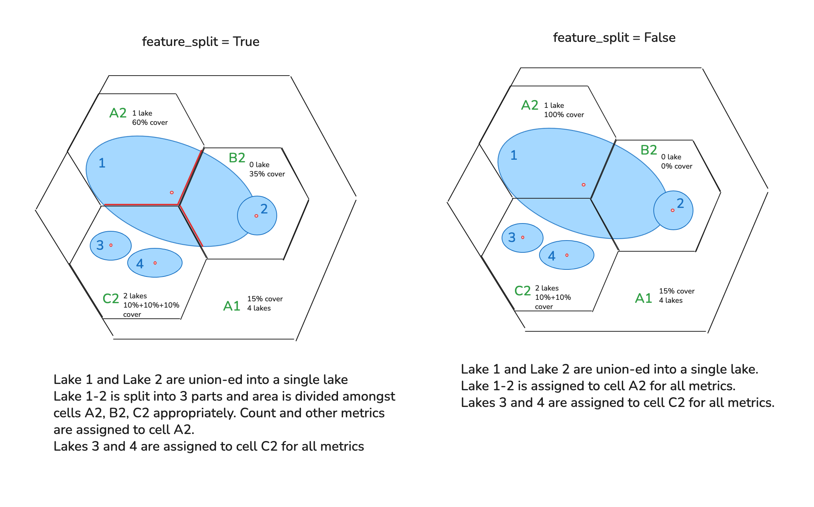

# H3 Grid Summary Generator

**Goal:** Convert feature geometries into H3 cell indices based on their center points, then aggregate total counts, raw areas, and custom feature attributes into a uniform hexagonal grid.

1. For any input geometry file: compute an absolute `_count` per H3 cell (how many feature centroids fall within the cell).
2. For polygon features: compute the total `area_km2` and `percent_cover` assigned to the cell
3. Aggregate custom attributes using true mathematical sums (`sum_*`) and means (`mean_*`).
4. Optionally compute land-only statistics: `land_area_km2`, `land_fraction`, and `land_coverage_fraction` during final assembly.

### Summary Statistics Methodology

The `H3GridSummaryGenerator` calculates summary statistics by examining each feature in a dataset, and assigning that feature to H3 in each resolution requested. For points, the point itself is used, otherwise the centroid of the feature is used to determine which cell should contain the summary metrics. `_count`, `sum_*`, and `mean_*` attributes are calculated by assigning each feature to one and only one H3 cell, using the centroid. The `h3_intersect_h3_cells` configuration option in `viz-workflow` allows for `area_km2` and `percent_cover` to be calculated the same way, with all of a features area being assigned to one or only one cell (`intersect_h3_cells` = `False`). If `intersect_h3_cells` is set to `True`, features will be split across H3 cells they overlap, and `area_km2`, `percent_cover` are calculated accurately by cell. Note that `intersect_h3_cells` has no effect on `_count`, `sum_*`, and `mean_*` attributes, as fractional counts in many cases would not be sensible, nor would aggregation of `mean_*` attributes make sense. In addition to this configuration option, users can also choose whether to union overlapping features with `dissolve_overlaps`. This is done as part of pre-processing. If set to `True`, attributes for overlapping shapes are aggregated during this step (sum for `attr_to_sum` columns, mean for `attr_to_mean` columns), preventing double-counting feature counts and surface areas.

The diagram above illustrates how metrics are distributed to H3 cells from overlapping and non-overlapping polygons at two H3 zoom levels for both `intersect_h3_cells` `True` and `False`, and for `dissolve_overlaps` `True` and `False`.

#### intersect_h3_cells = False

This method assigns 100% of a feature's area, count, and attributes to the single H3 cell that contains its geometric centroid. It is best to use when the features are smaller than the H3 cells, or when downstream analysis depends on accurate counts or aggretating variables. In particular, any kind of area density calculation should be done on an unsplit dataset.

Pros:
    - Performance: Eliminates complex Shapely polygon intersections and multi-pass re-projections, so runs much faster.
    - Data Locality: Area and attributes remain perfectly coupled. The cell that gets the area also gets the count, sum, and mean data.
    - Simplicity: Conceptually straightforward and easy to debug.

Cons:
    - Area Distortion: If a feature is larger than an H3 cell, 100% of its area is dumped into the centroid cell, creating an artificial hotspot. Neighboring cells physically covered by the feature register 0 area.
    - Cover Fraction Inaccuracies: Dumping a massive polygon's area into a single cell could cause the cover_fraction to exceed 100.
    

#### intersect_h3_cells = True

This method physically cuts polygon geometries along H3 boundaries, distributing the `area_km2` across all touched cells while anchoring the feature count and attributes strictly to the centroid cell. This algorithm should be considered if features are larger than cells or if the most critical output is exact percent cover or area.

Pros:
    - Precise Area: area_km2 and cover_fraction accurately reflect the exact physical boundaries of the feature on the earth's surface.
    - Accurate High-Res Grids: Prevents massive polygons from breaking coverage metrics when mapped to high-resolution/small H3 cells.

Cons:
    Computationally Expensive: Requires boundary detection, geometric intersections, and projection transformations for every polygon overlapping multiple cells.
    Spatial Decoupling: Because counts and attributes (sum, mean) are assigned only to the centroid cell to prevent double-counting, a neighboring cell might report an area_km2 of 50 but a _count of 0. This can look unintuitive in tabular form.

#### dissolve_overlaps = False

This method is appropriate in most situations - polygons are left as distinct entities.

#### dissolve_overlaps = True

This method can be useful for certain datasets where the same feature is represented many times. For example, the DARTS dataset shows thaw slumps detected over a number of different years. The same slump often appears in the dataset 2-6 times, with slightly different boundaries. Using `dissolve_overlaps` = `True` in this case gives us the total area of land that has ever had a slump over the observation period. Note that if `dissolve_overlaps` = `True` and `intersect_h3_cells` = `False`, it may be more likely to get greater than 100% `percent_cover` values in cells if many polygons are chained together.

### Inputs

*   `input_path`: Path to an input vector dataset (.shp, .gpkg, .parquet).
*   `output_paths`: Dictionary mapping H3 resolutions to their final output GeoPackage paths (e.g., `{3: "out_res3.gpkg", 4: "out_res4.gpkg"}`).
*   `h3_res`: List of H3 resolutions to process simultaneously (e.g., `[3, 4]`).
*   `intersect_h3_cells` (optional): Whether to split polygon features across H3 cells for area and cover calculations. Default False.
*   `attr_to_sum` (optional): List of numeric column names to sum across features.
*   `attr_to_mean` (optional): List of numeric column names to average across features.
*   `land_polygons_path` (optional): Land/coastline polygon dataset path (applied in the combination step).
*   `area_epsg`: Equal-area EPSG code for accurate area computations (default `6933`).

### Outputs
*   **Intermediate:** Lightweight Parquet files (chunks) saved in an adjacent `/chunks/` directory.
*   **Final:** H3 polygon layers (GeoPackages) with fully aggregated attributes, created after combining all chunks.

---

## Methodology

### Chunking and Staging: `build_h3_summary()`
This method processes individual files and stages them as lightweight Parquet chunks.

1. **Load, Filter, and Union overlaps**
    * Read input into a GeoDataFrame and reproject to WGS84 (EPSG:4326) because H3 indexing expects lon/lat.
    * Filter out duplicate polygons that spilled over from adjacent processing tiles (eg: files generated by staging)
      using `staging_centroid_within_tile`.
    * Merge overlapping polygons using `unary_union` into single contiguous geometries. Attributes for overlapping shapes are aggregated during this step (sum for `attr_to_sum` columns, mean for `attr_to_mean` columns). This prevents double-counting feature counts and surface areas.

2. **Vectorized Area Calculation**
    * If the dataset contains polygons, reproject to the `area_epsg`.
    * Store the total area by feature in a new `area_km2` column.

3. **H3 Indexing and Feature Splitting**
    * Without Splitting (`intersect_h3_cells=False`): Find the feature centroid and map it to a single H3 cell per resolution.
    * With Splitting (`intersect_h3_cells=True`): Identify all H3 cells touched by the geometry using boundary overlapping. Intersect the polygon with each cell's boundary and reproject slivers to `area_epsg` to measure individual sliver areas.
    * Area & Ratio Normalization: Calculate sliver areas relative to the total sum of sliver areas to ensure 100% total area conservation.
    * Count Conservation: Assign _count = 1 only to the cell containing the feature's centroid; non-centroid split slivers receive _count = 0.

4. **Extract Metrics & Save to Parquet**
    * Create a record containing the `h3_index`, `_count: 1`, the full `area_km2`, and the raw values for any `attr_to_sum` or `attr_to_mean` columns. Note `attr_to_mean` columns are summed here, and actual means are calculated in the final aggregation.
    * Aggregate these records at the file level (summing everything, *including* the mean attributes to prepare for later division).
    * Save directly to `.parquet` (dropping geometries to maximize I/O speed).

### Final Aggregation: `combine_h3_summaries()`
This method gathers all generated Parquet chunks and merges them into the final spatial H3 grid.

1. **Merge & Sum**
    * Load all `.parquet` chunks for a given resolution and concatenate them.
    * Group by `h3_index` and perform a final summation of `_count`, `area_km2`, `percent_cover`, `sum_*` columns, and the staged `mean_*` columns.

2. **Calculate True Means**
    * To avoid statistical bugs, calculate means only at the very end (no mean-of-means with different sample sizes): 
    * `final_gdf["mean_col"] = final_gdf["mean_col"] / final_gdf["_count"]`

3. **Generate Geometries & Output**
    * Convert the string H3 indices back into hexagonal Shapely polygons.
    * (Optional) Intersect with `land_polygons_path` to generate `land_area_km2` metrics.
    * Export the final GeoDataFrame to the specified output GeoPackage.