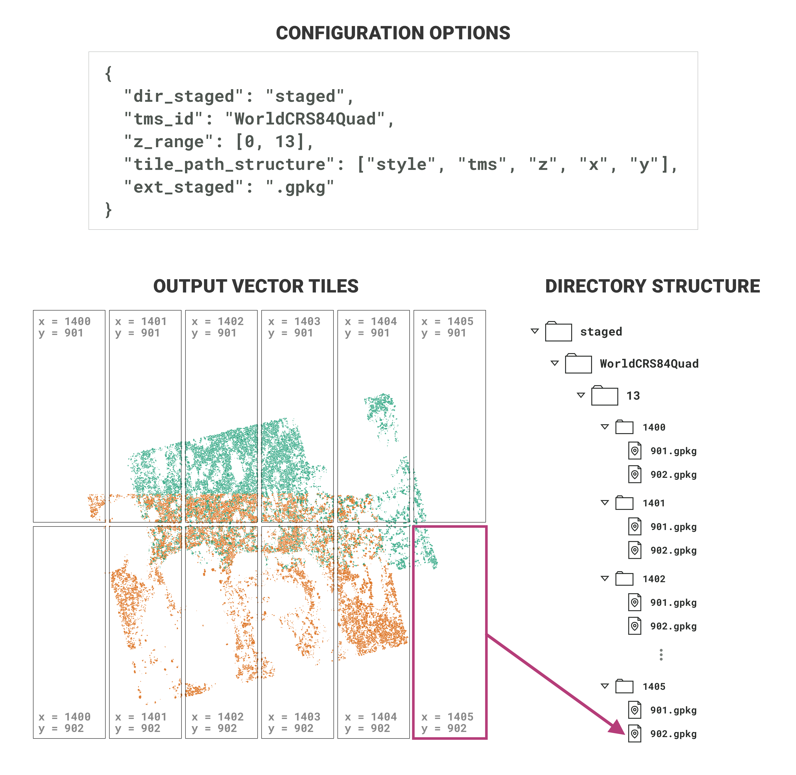

# Hierarchical directory structure for tiles

The vector tiles that are outputted by pdgstaging are saved to a standardized directory structure. The path to each tile comprises the tms (TileMatrixSet), style (layer/statistic), x-index (TileCol), y-index (TileRow), and z-index (TileMatrix) of the tile. By default, the path will be in the format `{basePath}/{TileMatrixSet}/{Style}/{TileMatrix}/{TileCol}/{TileRow}.{ext}`, but the order of these elements can be specified using the `tile_path_structure` option in the config.

